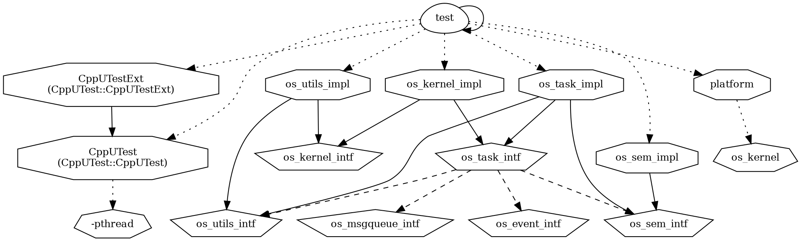

* I broke out the library into their own logical components to better
  facilitate testing. All of the libraries pulled in the parent include file
  `cocoos.h`, which is convenient because you don't have to keep track of
  dependencies. However, it makes it very difficult to test because if all of
  the components have a many-to-many relationship they can't be split apart to
  test them independently.

  As such I think it makes more sense to split up the design into discrete
  logical components that can be addressed individually.

