* I broke out the library into their own logical components to better
  facilitate testing. All of the libraries pulled in the parent include file
  `cocoos.h`, which is convenient because you don't have to keep track of
  dependencies. However, it makes it very difficult to test because if all of
  the components have a many-to-many relationship they can't be split apart to
  test them independently.

  As such I think it makes more sense to split up the design into discrete
  logical components that can be addressed individually.

* Consider the usage of stdbool.h and whether it's compatible with all
  platforms

* I think the library configs should be a file provided by the user, though I
  need to think about the implications of how to do this with cmake (or not
  cmake if the useres opt not to use it). Splitting the library into logical
  components begets testing, but doesn't share the global defines like was
  orginally expected.

* I've been removing the lic code to make it more readable.

* Changed Sem_t backing type to be int16 to allow for negative numbers

* The scheduling macros are clever. On re-entry into the function the "last
  saved state" is function of the line number (it's really not important what
  the number is), only that it doesn't conflict with a valid state like READY.

  On re-entry into the function after the first time, the saved state will be
  the same. That's also why the for loop is crucial, b/c you won't be in a
  READY state, but the for loop jumps you up to the top of the case. I have an
  example of the expanded macros [here](https://godbolt.org/z/z4vPd5Wh7). This
  is really clever and simulates the effect of having a `for(;;)` inside a task
  which makes people comfortable and is brilliant. Over-all the idea is quite
  good.

  What I _don't_ like about it is:
  * It's very difficult to tell what's going on. It breaks down to something
    like below. There's a for loop broken up by a case statement, semi-colons
    in weird places. I'm no the fence if I should leave it like this and simply
    document the behavior, or if I should make it something more predictable /
    understandable.

  ```c
      switch ( os_task_state )
    {
        case 0:;
               for(;;)
               {
                   printf("foo %d\n", os_task_state);
                   do {
                        printf("inside_do %d\n", os_task_state);
                        return;
                        case (44 +0):;
                   } while ( 0 );
               }

            printf("done task\n")
  ```

  * The internal state being dependent on line-number I fear will cause
    problems, especially if a task conflicted with a valid state.

  * I'm worried some optimizer will see the expanded macros and say "uh, no",
    or more likely, static analyais will yell b/c of this crazy formulation.

  * `running_tid` ends up being a global variable which can be manipulated by
    _anyone_, which seems bad. This is becuase the macros end up expanding to
    `uint16_t os_task_state = task_internal_state_get(running_tid);` in order
    to get the `internal_state` of _this_ task. Simulating OOP for this small
    part would probably be safer if possible.

  * The macros create variables with names, so if you were unlikely and chose
    the same variable name, it would fail to compile but in a really weird way.

  * ~~There's a bug which is for the _first_ run in a `for(;;)` definition, if
    you have any code _after_ a `task_wait` it will never get called (b/c you
    start in case 0) and jump to return as soon as you set the wait state.~~
    This isn't the case, it works as expected.

  * I'd like to turn this into something MISRA compliant, and the heavy marcro
    usage violates
    > Misra rule 19.7 : A function should be used in preference to a function-like macro
    I think removing or at least removing the heavy macro usage will allow for
    something more robust, safer, and test-able. All of this text subsitution
    is a strong code smell, even though I do think it's really clever. I think
    there's some control flow implementation that will probably achieve
    something similar

  * I'm starting to really understand why these macros leverage `switch`
    statements and not `goto` labels. Using the LINE lets you create an
    arbitrary state (which I knew), but it's numbered, not named. It also lets
    you add as many scheduling macros as you'd like, b/c it just adds a case
    which is dependent on the __LINE__. My 2 concerns are 1. w/o using `{}` in
    the switch statements, will the compiler complain about a variable
    decleration between scheduling macros? 2. What if __LINE__ conflicts with
    an actual case used by the user in a switch statement, that's a very
    difficult bug to track down.

    ~~Even if the compiler doesn't complain, the below will print 0, b/c x is
    valid and scoped to the switch statement (which is fine), but let's say we
    re-enter on case 2, previously having entered case 1...you're going to have
    a bad time b/c x is going to be wrong, b/c the previous value of x was
    pop'd off the stack...and yet here you are using it. This can probably be
    fixed by adding an explicit variable store/restore function that the user
    opts to use to store variables between re-entry.~~ This is a known
    limitation of the implementation. The solutionis to decalre all of your
    variables static, or, pass the task a pointer to data that you're going to
    want to access.

    ```
       switch(2)
    {
        case 0:
        case 1:
            char x = 10;
            printf("hello\n");
        case 2:
            printf("%d\n", x);
        default:
            break;
    }
    ```

    * After a ton of heart-ache, I've figured out that this is just Duff's
      Device for approximating re-entrant code whilst abusing the C macro. As
      such, I'm not going to change the program flow, though I am going to
      change a few things.

```dot
digraph "test" {
node [
  fontsize = "12"
];
subgraph clusterLegend {
  label = "Legend";
  color = black;
  edge [ style = invis ];
  legendNode0 [ label = "Executable", shape = egg ];
  legendNode1 [ label = "Static Library", shape = octagon ];
  legendNode2 [ label = "Shared Library", shape = doubleoctagon ];
  legendNode3 [ label = "Module Library", shape = tripleoctagon ];
  legendNode4 [ label = "Interface Library", shape = pentagon ];
  legendNode5 [ label = "Object Library", shape = hexagon ];
  legendNode6 [ label = "Unknown Library", shape = septagon ];
  legendNode7 [ label = "Custom Target", shape = box ];
  legendNode0 -> legendNode1 [ style = solid ];
  legendNode0 -> legendNode2 [ style = solid ];
  legendNode0 -> legendNode3;
  legendNode1 -> legendNode4 [ label = "Interface", style = dashed ];
  legendNode2 -> legendNode5 [ label = "Private", style = dotted ];
  legendNode3 -> legendNode6 [ style = solid ];
  legendNode0 -> legendNode7;
}
    "node0" [ label = "CppUTest\n(CppUTest::CppUTest)", shape = octagon ];
    "node1" [ label = "-pthread", shape = septagon ];
    "node0" -> "node1" [ style = dotted ] // CppUTest -> -pthread
    "node2" [ label = "CppUTestExt\n(CppUTest::CppUTestExt)", shape = octagon ];
    "node2" -> "node0"  // CppUTestExt -> CppUTest
    "node3" [ label = "mocks", shape = octagon ];
    "node3" -> "node0" [ style = dotted ] // mocks -> CppUTest
    "node3" -> "node2" [ style = dotted ] // mocks -> CppUTestExt
    "node4" [ label = "os_event_impl", shape = octagon ];
    "node5" [ label = "os_event_intf", shape = pentagon ];
    "node4" -> "node5" [ style = dotted ] // os_event_impl -> os_event_intf
    "node6" [ label = "os_kernel_intf", shape = pentagon ];
    "node7" [ label = "os_msgqueue_intf", shape = pentagon ];
    "node7" -> "node5" [ style = dashed ] // os_msgqueue_intf -> os_event_intf
    "node8" [ label = "os_utils_intf", shape = pentagon ];
    "node7" -> "node8" [ style = dashed ] // os_msgqueue_intf -> os_utils_intf
    "node6" -> "node7" [ style = dashed ] // os_kernel_intf -> os_msgqueue_intf
    "node9" [ label = "os_sem_intf", shape = pentagon ];
    "node6" -> "node9" [ style = dashed ] // os_kernel_intf -> os_sem_intf
    "node10" [ label = "os_task_intf", shape = pentagon ];
    "node10" -> "node5" [ style = dashed ] // os_task_intf -> os_event_intf
    "node10" -> "node7" [ style = dashed ] // os_task_intf -> os_msgqueue_intf
    "node10" -> "node9" [ style = dashed ] // os_task_intf -> os_sem_intf
    "node10" -> "node8" [ style = dashed ] // os_task_intf -> os_utils_intf
    "node6" -> "node10" [ style = dashed ] // os_kernel_intf -> os_task_intf
    "node4" -> "node6" [ style = dotted ] // os_event_impl -> os_kernel_intf
    "node11" [ label = "os_kernel_impl", shape = octagon ];
    "node11" -> "node5"  // os_kernel_impl -> os_event_intf
    "node11" -> "node6"  // os_kernel_impl -> os_kernel_intf
    "node11" -> "node10"  // os_kernel_impl -> os_task_intf
    "node11" -> "node8"  // os_kernel_impl -> os_utils_intf
    "node12" [ label = "os_msgqueue_impl", shape = octagon ];
    "node12" -> "node6"  // os_msgqueue_impl -> os_kernel_intf
    "node12" -> "node7"  // os_msgqueue_impl -> os_msgqueue_intf
    "node13" [ label = "os_sem_impl", shape = octagon ];
    "node13" -> "node9"  // os_sem_impl -> os_sem_intf
    "node14" [ label = "os_task_impl", shape = octagon ];
    "node14" -> "node6"  // os_task_impl -> os_kernel_intf
    "node14" -> "node9"  // os_task_impl -> os_sem_intf
    "node14" -> "node10"  // os_task_impl -> os_task_intf
    "node14" -> "node8"  // os_task_impl -> os_utils_intf
    "node15" [ label = "os_utils_impl", shape = octagon ];
    "node15" -> "node6"  // os_utils_impl -> os_kernel_intf
    "node15" -> "node8"  // os_utils_impl -> os_utils_intf
    "node16" [ label = "platform", shape = octagon ];
    "node16" -> "node6" [ style = dotted ] // platform -> os_kernel_intf
    "node17" [ label = "test", shape = egg ];
    "node17" -> "node0" [ style = dotted ] // test -> CppUTest
    "node17" -> "node2" [ style = dotted ] // test -> CppUTestExt
    "node17" -> "node4" [ style = dotted ] // test -> os_event_impl
    "node17" -> "node11" [ style = dotted ] // test -> os_kernel_impl
    "node17" -> "node12" [ style = dotted ] // test -> os_msgqueue_impl
    "node17" -> "node13" [ style = dotted ] // test -> os_sem_impl
    "node17" -> "node14" [ style = dotted ] // test -> os_task_impl
    "node17" -> "node15" [ style = dotted ] // test -> os_utils_impl
    "node17" -> "node16" [ style = dotted ] // test -> platform
    "node17" -> "node17"  // test -> test
}
```



